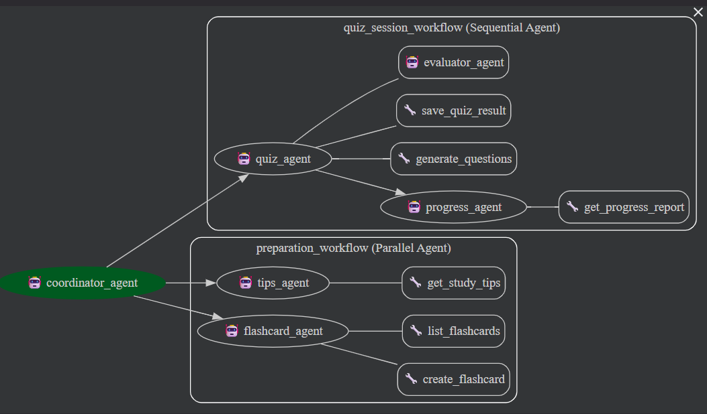
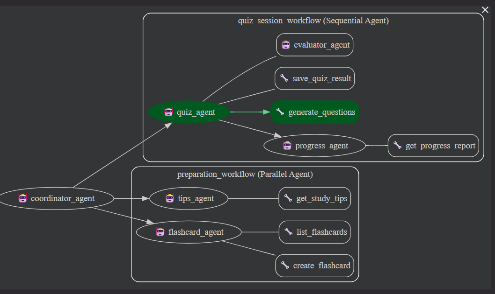
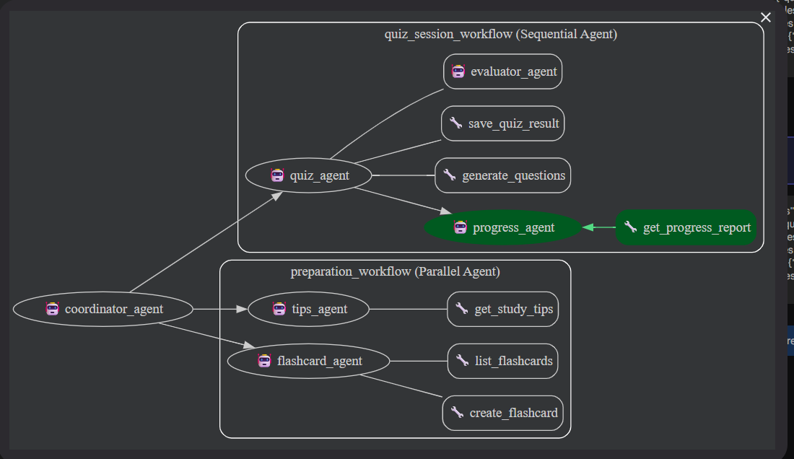
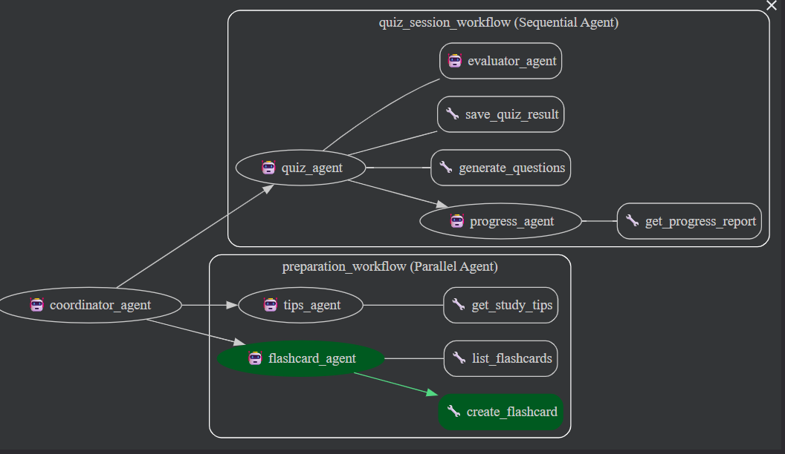

# Assistant de Revision — Systeme Multi-Agents ADK

Systeme multi-agents pedagogique developpe avec le framework **Google ADK** et **Ollama** (Mistral 7B).
L'assistant aide les etudiants a reviser efficacement via des quiz interactifs, des fiches de revision et un suivi de progression.

---

## Architecture multi-agents

```
coordinator_agent (LlmAgent, root)
├── quiz_session_workflow    (SequentialAgent)
│   ├── quiz_agent           (LlmAgent) — utilise evaluator_agent via AgentTool
│   │   └── evaluator_agent  (LlmAgent)
│   └── progress_agent       (LlmAgent)
├── preparation_workflow     (ParallelAgent)
│   ├── flashcard_agent      (LlmAgent)
│   └── tips_agent           (LlmAgent)
└── flashcard_loop_workflow  (LoopAgent, max 2 iterations)
    ├── loop_flashcard_agent     (LlmAgent)
    └── flashcard_checker_agent  (LlmAgent)
```

### Captures d'ecran — Interface ADK Web









---

## Contraintes techniques satisfaites

| # | Contrainte | Implementation |
|---|---|---|
| 1 | Minimum 3 agents | 8 LlmAgents: coordinator, quiz, evaluator, flashcard, progress, tips, loop_flashcard, flashcard_checker |
| 2 | Au moins 3 tools custom | 6 tools: `generate_questions`, `save_quiz_result`, `create_flashcard`, `list_flashcards`, `get_progress_report`, `get_study_tips` |
| 3 | Au moins 2 Workflow Agents | 3 Workflows: `SequentialAgent` + `ParallelAgent` + `LoopAgent` |
| 4 | State partage | `output_key="quiz_result"` sur quiz_agent puis `{quiz_result}` dans progress_agent, `{flashcards_result}` dans flashcard_checker |
| 5 | Les 2 mecanismes de delegation | `transfer_to_agent` via sub_agents du coordinator + `AgentTool(evaluator_agent)` dans quiz_agent |
| 6 | Au moins 2 callbacks | 5 types sur 6: `before_agent_callback`, `after_agent_callback`, `before_tool_callback`, `after_tool_callback`, `before_model_callback` |
| 7 | Runner programmatique | `main.py` avec `Runner` + `InMemorySessionService` |
| 8 | Demo fonctionnelle | `adk web` dans le dossier `tp-adk/` |

---

## Installation

```bash
# 1. Cloner le projet
git clone <url-du-repo>
cd tp-adk

# 2. Creer l'environnement virtuel
python -m venv .venv

# 3. Activer l'environnement
# Windows PowerShell:
.venv\Scripts\Activate.ps1
# Windows CMD:
.venv\Scripts\activate.bat
# Mac/Linux:
source .venv/bin/activate

# 4. Installer les dependances
pip install google-adk litellm

# 5. Verifier qu'Ollama tourne avec Mistral
ollama run mistral
```

---

## Lancement

### Interface web (recommandee)

```bash
# Depuis le dossier tp-adk/
adk web
```

Puis ouvre http://localhost:8000 dans ton navigateur et selectionne `assistant_revision`.

### Terminal interactif

```bash
python main.py
```

### CLI ADK

```bash
adk run assistant_revision
```

---

## Exemples de requetes

### Quiz interactif

```
"Je veux faire un quiz sur Python"
"Lance un quiz de 5 questions sur les algorithmes de tri"
"Quiz sur les bases de donnees SQL"
```

### Fiches de revision

```
"Cree des fiches de revision sur les listes Python"
"Fais-moi des flashcards sur la recursivite"
"Je veux des fiches sur les design patterns"
```

### Revision complete (parallele)

```
"Prepare-moi une revision complete sur les graphes"
"Je veux me preparer pour mon exam sur Python oriente objet"
```

### Progression

```
"Montre-moi ma progression"
"Quels sont mes resultats?"
"Comment je progresse?"
```

---

## Structure du projet

```
tp-adk/
├── .venv/                          # Environnement virtuel
├── .gitignore
├── README.md
├── main.py                         # Runner programmatique
├── screenshots/                    # Captures d'ecran de la demo
├── tests/
│   └── test_tools.py              # 27 tests unitaires (pytest)
└── assistant_revision/             # Package agent ADK
    ├── __init__.py                 # from . import agent
    ├── agent.py                    # Definition de tous les agents
    ├── .env                        # Config modele (non committe)
    └── tools/
        ├── __init__.py
        ├── quiz_tools.py           # generate_questions, save_quiz_result
        ├── flashcard_tools.py      # create_flashcard, list_flashcards
        └── progress_tools.py       # get_progress_report, get_study_tips
```

### Tests

```bash
pip install pytest
python -m pytest tests/test_tools.py -v
```

27 tests couvrant les 6 outils custom: validation des entrees, conversions de types, gestion d'erreurs, mentions et filtres.

---

## Problemes rencontres et solutions

### 1. Hallucination des noms d'outils

**Probleme**: Mistral 7B inventait des noms d'outils inexistants (`display_questions`, `present_progress_report`, `print_flashcard`) au lieu d'utiliser les vrais noms (`generate_questions`, `get_progress_report`). Cela provoquait une erreur `Tool 'xxx' not found`.

**Solution**: Ajout d'un callback `strip_tools_after_use` (`before_model_callback`) qui retire tous les outils du LLM apres le premier appel reussi. Sans outils disponibles, Mistral est force de repondre en texte et ne peut plus halluciner de noms.

### 2. Appels d'outils en boucle infinie

**Probleme**: Mistral appelait le meme outil plusieurs fois de suite (ex: `generate_questions` appele 3 fois). Le LLM ne comprenait pas qu'il avait deja les resultats et relancait l'outil indefiniment.

**Solution**: Ajout d'un callback `prevent_tool_loop` (`before_tool_callback`) qui utilise le state partage pour tracker les outils deja appeles. Si un outil est appele une 2eme fois, le callback retourne directement un message sans executer l'outil.

### 3. Modeles 3B trop petits pour le function calling

**Probleme**: Les modeles legers testes (Llama 3.2 3B, Qwen 2.5 3B) ne gereraient pas du tout le function calling ADK. Ils inventaient des outils comme `welcome_user` ou `Bonjour`, ou tournaient en boucle infinie sans jamais repondre.

**Solution**: Retour a Mistral 7B qui gere correctement le function calling, meme s'il est plus lent (~60s par appel LLM).

### 4. Routing non fiable du coordinateur

**Probleme**: Le coordinateur devait choisir quel workflow activer via `transfer_to_agent`, mais Mistral appelait parfois des noms incorrects (`transfer_to_quiz_session_workflow` au lieu de `transfer_to_agent` avec l'argument `agent_name`).

**Solution**: Ajout d'un callback `smart_router` (`before_model_callback`) sur le coordinateur. Il detecte les mots-cles dans le message utilisateur ("quiz" -> quiz_session_workflow, "fiche" -> preparation_workflow) et genere directement le `transfer_to_agent` en Python, sans passer par le LLM.

### 5. Conversion de types (str vs int)

**Probleme**: Mistral passait les arguments numeriques sous forme de string (ex: `count="3"` au lieu de `count=3`), provoquant des `TypeError`.

**Solution**: Ajout de `int()` avec `try/except` dans les outils `generate_questions` et `save_quiz_result` pour convertir automatiquement les strings en entiers.

### 6. ParallelAgent et Ollama en serie

**Probleme**: Le `ParallelAgent` lance les agents en parallele, mais Ollama traite les requetes LLM une par une (pas de parallelisme GPU). Un des agents pouvait timeout (600s) en attendant que l'autre finisse.

**Solution**: Limitation connue d'Ollama en local. Les deux agents s'executent bien en parallele cote ADK, mais les appels LLM sont traites sequentiellement par Ollama.

---

## Modele utilise

**Mistral 7B** via Ollama (local, pas de cle API necessaire).

Au debut du developpement, nous avons teste **Llama 3.2 3B** pour sa rapidite. Cependant, ce modele etait trop petit pour gerer correctement le function calling d'ADK : il inventait des outils inexistants (`welcome_user`, `Bonjour`) et tournait en boucle infinie. Nous sommes donc passes a **Mistral 7B** qui gere beaucoup mieux les appels d'outils, meme s'il est plus lent (~60s par appel LLM).

Pour changer de modele, modifie `MODEL` dans `assistant_revision/agent.py`:

```python
MODEL = "ollama/mistral"      # Mistral 7B (defaut, recommande)
MODEL = "ollama/llama3.2"     # Llama 3.2 3B (trop petit pour le function calling)
MODEL = "ollama/gemma2:2b"    # Gemma 2 2B (non teste)
```
