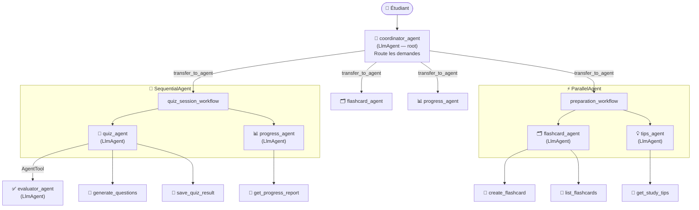

# Assistant de Révision — Système Multi-Agents ADK

Système multi-agents pédagogique développé avec le framework **Google ADK** et **Ollama** (Mistral 7B).
L'assistant aide les étudiants à réviser efficacement via des quiz interactifs, des fiches de révision et un suivi de progression.

---

## Architecture multi-agents



---

## Contraintes techniques satisfaites

| # | Contrainte | Implémentation |
|---|---|---|
| 1 | Minimum 3 agents | 5 LlmAgents: coordinator, quiz, evaluator, flashcard, progress, tips |
| 2 | Au moins 3 tools custom | 6 tools: `generate_questions`, `save_quiz_result`, `create_flashcard`, `list_flashcards`, `get_progress_report`, `get_study_tips` |
| 3 | Au moins 2 Workflow Agents | `SequentialAgent` (quiz_session_workflow) + `ParallelAgent` (preparation_workflow) |
| 4 | State partagé | `output_key="quiz_result"` sur quiz_agent → `{quiz_result}` dans progress_agent |
| 5 | Les 2 mécanismes de délégation | `transfer_to_agent` via sub_agents du coordinator + `AgentTool(evaluator_agent)` dans quiz_agent |
| 6 | Au moins 2 callbacks | `before_agent_callback` (log_agent_start) + `after_tool_callback` (log_tool_result) |
| 7 | Runner programmatique | `main.py` avec `Runner` + `InMemorySessionService` |
| 8 | Démo fonctionnelle | `adk web` dans le dossier `tp-adk/` |

---

## Installation

```bash
# 1. Cloner le projet
git clone <url-du-repo>
cd tp-adk

# 2. Créer l'environnement virtuel
python -m venv .venv

# 3. Activer l'environnement
# Windows PowerShell:
.venv\Scripts\Activate.ps1
# Windows CMD:
.venv\Scripts\activate.bat
# Mac/Linux:
source .venv/bin/activate

# 4. Installer les dépendances
pip install google-adk litellm

# 5. Vérifier qu'Ollama tourne avec Mistral
ollama run mistral
```

---

## Lancement

### Interface web (recommandée)

```bash
# Depuis le dossier tp-adk/
adk web
```

Puis ouvre http://localhost:8000 dans ton navigateur et sélectionne `assistant_revision`.

### Terminal interactif

```bash
python main.py
```

### CLI ADK

```bash
adk run assistant_revision
```

---

## Exemples de requêtes

### Quiz interactif

```
"Je veux faire un quiz sur Python"
"Lance un quiz de 5 questions sur les algorithmes de tri"
"Quiz sur les bases de données SQL"
```

### Fiches de révision

```
"Crée des fiches de révision sur les listes Python"
"Fais-moi des flashcards sur la récursivité"
"Je veux des fiches sur les design patterns"
```

### Révision complète (parallèle)

```
"Prépare-moi une révision complète sur les graphes"
"Je veux me préparer pour mon exam sur Python orienté objet"
```

### Progression

```
"Montre-moi ma progression"
"Quels sont mes résultats?"
"Comment je progresse?"
```

---

## Structure du projet

```
tp-adk/
├── .venv/                          # Environnement virtuel
├── .gitignore
├── README.md
├── main.py                         # Runner programmatique
└── assistant_revision/             # Package agent ADK
    ├── __init__.py                 # from . import agent
    ├── agent.py                    # Définition de tous les agents
    ├── .env                        # Config modèle (non committé)
    └── tools/
        ├── __init__.py
        ├── quiz_tools.py           # generate_questions, save_quiz_result
        ├── flashcard_tools.py      # create_flashcard, list_flashcards
        └── progress_tools.py      # get_progress_report, get_study_tips
```

---

## Modèle utilisé

**Mistral 7B** via Ollama (local, pas de clé API nécessaire).

Pour changer de modèle, modifie `MODEL` dans `assistant_revision/agent.py`:

```python
MODEL = "ollama/mistral"      # Mistral 7B (défaut)
MODEL = "ollama/llama3.2"     # Llama 3.2 3B (plus rapide)
MODEL = "ollama/gemma2:2b"    # Gemma 2 2B (très rapide)
```
